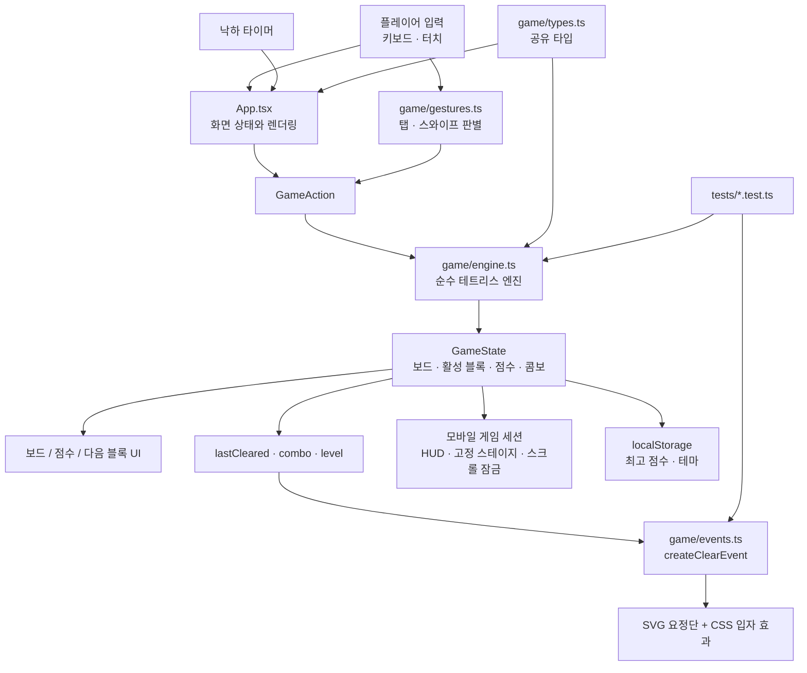

# 별빛 테트리스 ✦

보석 블록을 쌓아 줄을 지우고, 별빛 요정단의 축하 이벤트를 만나는 반응형 웹 테트리스입니다. React, TypeScript, Vite로 만들었으며 PC 키보드와 모바일 터치 조작을 모두 지원합니다.

## 빠른 시작

요구 사항: Node.js 22 이상

```bash
git clone https://github.com/Photometry4040/example-starry-tetris.git
cd example-starry-tetris
npm install
npm run dev
```

Vite가 출력하는 로컬 주소를 브라우저에서 열면 플레이할 수 있습니다.

| 명령 | 용도 |
| --- | --- |
| `npm run dev` | 개발 서버 실행 |
| `npm test` | 게임 엔진과 이벤트 규칙 테스트 |
| `npm run build` | TypeScript 검사와 배포용 빌드 |
| `npm run preview` | 빌드 결과 미리보기 |

## 게임 방법

블록을 쌓아 가로줄을 빈칸 없이 채우면 줄이 사라집니다. 여러 줄과 콤보를 만들수록 더 큰 축하 효과가 나타납니다.

| 조작 | 키보드 | 모바일 |
| --- | --- | --- |
| 좌우 이동 | `←` `→` | 보드에서 좌우 스와이프 |
| 빠르게 내리기 | `↓` | 데스크톱·태블릿의 아래 버튼 |
| 회전 | `↑` 또는 `X`, `Z` | 보드를 탭 |
| 즉시 내리기 | `SPACE` | 보드에서 아래로 길게 스와이프 또는 `✦ DROP` |
| 블록 보관 | `C` | 모바일 보조바의 보관 버튼 |
| 일시정지 | `P` | 상단 또는 모바일 보조바 |

모바일에서는 첫 실행 때 제스처 안내를 보여 줍니다. 게임을 시작하면 문서 콘텐츠 대신 게임 전용 한 화면으로 전환되며, 보드 안의 시작·재도전 버튼으로 바로 플레이를 시작할 수 있습니다. 지원 기기는 회전·이동·드롭·줄 삭제에 짧은 햅틱 피드백을 제공하며, 모션 감소 설정에서는 진동과 장식 애니메이션을 줄입니다.

### 별빛 요정단 이벤트

- 1줄: 별요정의 **반짝 성공!** 별가루
- 2줄: 캔디 토끼의 **달콤한 더블!** 캔디 폭죽
- 3줄: 무지개 고양이의 **무지개 트리플!** 선물 이벤트
- 4줄: 세 친구가 함께하는 **별빛 축제!** 별 샤워
- 3콤보부터 입자와 응원 문구가 강화되고, 5콤보부터 하트·별 마법 링이 추가됩니다.

최고 점수와 선택한 테마는 브라우저의 `localStorage`에 저장됩니다. 10줄과 25줄을 달성하면 캔디·무지개 테마가 열립니다.

## 화면 반응형

게임 보드는 언제나 10×20, 즉 **1:2 비율**을 유지합니다. CSS의 `dvh`, `min()`, `clamp()`를 이용해 화면의 가로·세로 제약 중 작은 값을 기준으로 크기를 정합니다.

- 데스크톱: 보드와 좌우 정보 패널을 한 줄로 표시
- 태블릿: 3열 구성을 유지하면서 패널과 간격을 축소
- 모바일 랜딩: 보드를 먼저 보여주고 제스처·컴팩트 보조바를 제공하며, 정보 카드와 테마 선택은 아래로 재배치
- 모바일 플레이: 헤더·미니 HUD·1:2 보드·보조바만 남긴 `100dvh` 게임 전용 화면으로 전환해 문서 스크롤과 오버스크롤을 잠금
- 짧은 화면·가로 화면: HUD·헤더·보조바를 함께 압축해 보드·조작 영역을 한 화면에 유지
- `prefers-reduced-motion`: 입자·튕김 애니메이션을 줄이고 정적인 축하 카드 표시

## 코드 구조



| 위치 | 역할 |
| --- | --- |
| `src/App.tsx` | 입력 처리, 게임 루프, 화면과 이벤트 오버레이 렌더링 |
| `src/game/types.ts` | 보드·블록·게임 상태 타입 정의 |
| `src/game/engine.ts` | 이동, 회전, 충돌, 고정, 줄 삭제, 점수 계산 |
| `src/game/events.ts` | 줄 수와 콤보에 맞는 캐릭터 이벤트 선택 |
| `src/game/gestures.ts` | 탭·좌우 스와이프·아래 스와이프를 게임 동작으로 판별 |
| `src/styles.css` | 테마, 반응형 레이아웃, 모바일 안전 영역, 캐릭터·입자 애니메이션 |
| `tests/` | 엔진·이벤트·모바일 제스처 단위 테스트 |

## 이번 실습 이력

1. **게임 요청과 기획**: 귀엽고 화려한 스타일 테트리스, 독립 React 웹게임, PC·모바일 반응형을 결정했습니다.
2. **핵심 게임 제작**: 10×20 보드, 7종 테트로미노, 이동·회전·낙하·하드드롭·홀드·점수·레벨·콤보·다음 블록을 구현했습니다.
3. **스타일과 저장 기능 추가**: 파스텔 보석 테마, 고스트 블록, 테마 해금, 최고 점수·선택 테마 `localStorage` 저장을 추가했습니다.
4. **실행과 수정**: 엔진 테스트와 프로덕션 빌드로 검증하고, 짧은 데스크톱·태블릿·모바일 화면에서 보드가 잘리지 않도록 반응형 크기 계산을 개선했습니다.
5. **흥미 요소 추가**: 줄 삭제 순간에 별요정·캔디 토끼·무지개 고양이가 나타나는 별빛 요정단 이벤트와 콤보 강화 효과를 추가했습니다.
6. **모바일 플레이 최적화**: 보드 탭 회전, 좌우 스와이프 이동, 아래 스와이프 즉시 드롭, 컴팩트 보조바, 첫 실행 안내, 지원 기기의 햅틱 피드백을 추가했습니다.
7. **모바일 한 화면 모드**: 플레이·일시정지·게임 오버 중에는 헤더, 미니 HUD, 보드, 보조바만 보이는 고정 게임 스테이지로 전환하고 페이지 스크롤을 잠갔습니다.

## 교육용 메타 프롬프트

아래 프롬프트를 Codex나 다른 코딩 AI에 그대로 붙여 넣으면, 학습자가 요구 사항을 단계적으로 구현하고 검증하도록 안내할 수 있습니다.

```text
당신은 초보 개발자를 돕는 React + TypeScript 게임 제작 튜터입니다.
목표는 Vite 기반의 독립 실행형 테트리스 웹게임을 만드는 것입니다.

프로젝트 조건
- 10×20 보드와 I, O, T, S, Z, J, L의 7종 테트로미노를 구현한다.
- 게임 로직은 UI와 분리한다. `types.ts`에는 공유 타입, `engine.ts`에는 순수 함수만 둔다.
- 이동, 회전, 충돌, 고정, 줄 삭제, 점수, 레벨, 콤보, 다음 블록, 홀드, 게임 오버를 구현한다.
- 키보드와 모바일 터치 조작을 모두 제공한다.
- 모바일 보드에서는 탭으로 회전하고, 좌우 스와이프로 이동하며, 아래 스와이프로 즉시 드롭한다. 제스처 판별은 `gestures.ts`의 순수 함수로 분리하고 단위 테스트한다.
- 모바일 UI는 보조 기능만 남긴 컴팩트 바를 사용하고, 첫 실행 때 조작 안내를 제공한다. Vibration API와 모션 감소 설정을 안전하게 처리한다.
- 모바일에서 게임이 시작되면 헤더·미니 HUD·1:2 보드·보조바만 남긴 `100dvh` 전용 화면으로 바꾸고, `body`의 스크롤·오버스크롤을 잠근다. 준비·게임 오버 오버레이에는 보드 안에서 누를 수 있는 시작·재도전 버튼을 둔다.
- 보드는 1:2 비율을 유지하고, `dvh`, `min()`, `clamp()`로 화면 크기에 맞춘다.
- 줄을 지우면 귀여운 캐릭터 이벤트를 보여 준다. 이벤트 선택 규칙은 별도 순수 함수로 만든다.
- `prefers-reduced-motion` 사용자는 정적이고 짧은 효과만 보게 한다.
- 최고 점수와 선택 테마는 localStorage에 저장한다.

작업 방식
1. 먼저 현재 파일 구조와 package.json을 읽고, 수정 범위를 짧게 설명한다.
2. 타입과 순수 게임 엔진을 먼저 구현하고 단위 테스트를 작성한다.
3. UI와 CSS를 구현한다. 외부 이미지 없이 CSS/SVG를 활용한다.
4. 기능 단위로 실행해 오류를 수정한다.
5. `npm test`와 `npm run build`를 반드시 실행하고 결과를 보고한다.
6. 변경한 파일, 주요 기능, 실행 방법, 남은 제한 사항을 한국어로 간결하게 정리한다.

주의 사항
- 기존 사용자 파일과 무관한 코드는 수정하지 않는다.
- node_modules, dist, 환경 변수 파일은 Git에 커밋하지 않는다.
- 막히면 추측으로 덮어쓰지 말고 오류 원인을 먼저 확인한다.
```

## 검증 현황

```text
npm test      # 17개 테스트 통과
npm run build # TypeScript 검사 및 Vite 프로덕션 빌드 통과
```
